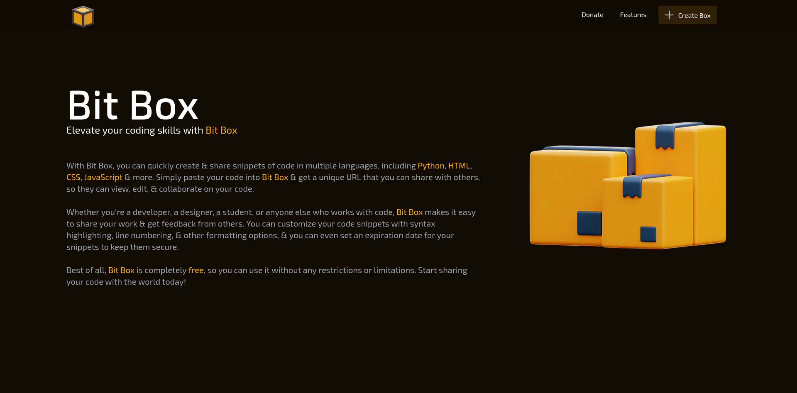
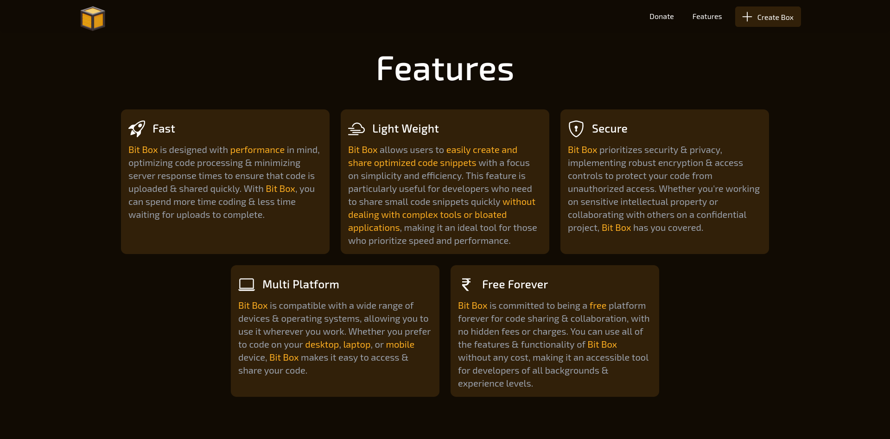
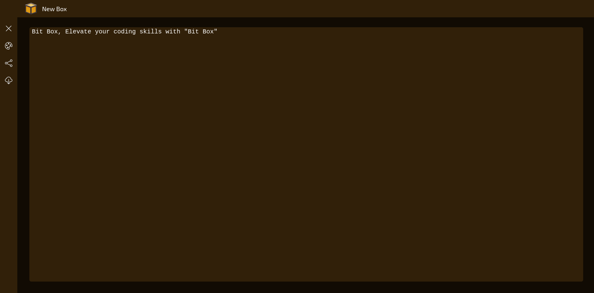

<div align="center">


Elevate your coding skills with Bit Box

</div>

## ❓️ What is Bit Box?

With Bit Box, you can quickly create and share snippets of code in multiple languages, including Python, HTML, CSS, JavaScript and more. Simply paste your code into Bit Box and get a unique URL that you can share with others, so they can view, edit, and collaborate on your code.
Whether you're a developer, a designer, a student, or anyone else who works with code, Bit Box makes it easy to share your work and get feedback from others. You can customize your code snippets with syntax highlighting, line numbering, and other formatting options, and you can even set an expiration date for your snippets to keep them secure.
Best of all, Bit Box is completely free, so you can use it without any restrictions or limitations. Start sharing your code with the world today!

## 🎬️ Preview

- **Welcome Page**

    

- **Features Section**

    

- **IDE Page**

    

## 🚀 Installation

1. Clone this repository
    ```sh
    git clone https://github.com/swayam25/Bit-Box bit_box
    cd bit_box
    ```

2. Install dependencies
    - Backend
        ```sh
        cd server
        python -m venv .venv
        source .venv/bin/activate
        pip install -r requirements.txt
        ```

    - Frontend
        ```sh
        cd client
        npm i
        ```

3. Configure the [`config.json`](./config.json) file

4. Start the app
    - Backend
        ```sh
        cd server
        source .venv/bin/activate
        python -m uvicorn main:app --host localhost --port 2501
        ```
    - Frontend
        ```sh
        cd client
        npm run dev -- --host --port 2500
        ```

5. URLs
    - Backend: `http://localhost:2501`
    - Frontend: `http://localhost:2500`

