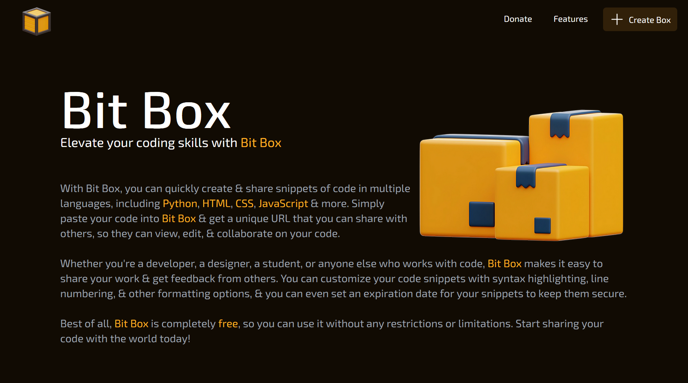
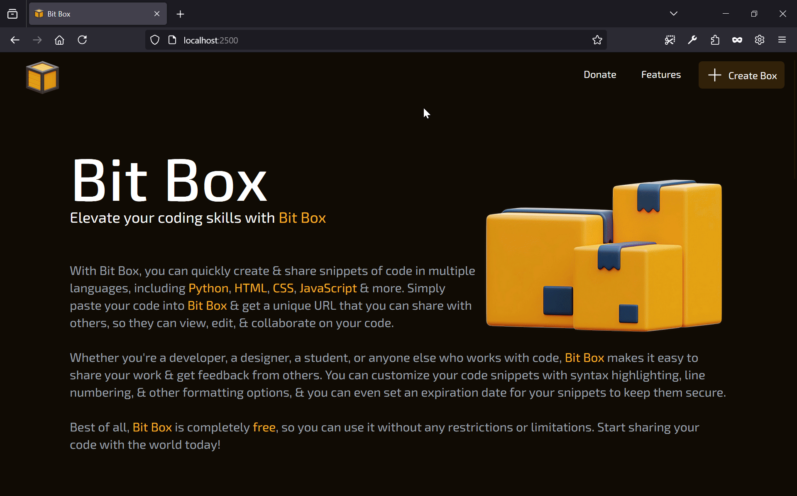

<div align="center">


Elevate your coding skills with Bit Box

</div>

## 🎬️ Preview

- **Main Page**

    

- **Share Box**

    

## 🚀 Installation

1. Clone this repository
    ```sh
    git clone https://github.com/swayam25/Bit-Box bit_box
    cd bit_box
    ```

2. Install dependencies
    - Backend
        ```sh
        cd server
        python -m venv .venv
        source .venv/bin/activate
        pip install -r requirements.txt
        ```

    - Frontend
        ```sh
        cd client
        npm i
        ```

3. Configure the [`config.json`](./config.json) file

4. Start the app
    - Backend
        ```sh
        cd server
        source .venv/bin/activate
        python -m uvicorn main:app --host localhost --port 2501
        ```
    - Frontend
        ```sh
        cd client
        npm run dev -- --host --port 2500
        ```

5. URLs
    - Backend: `http://localhost:2501`
    - Frontend: `http://localhost:2500`

